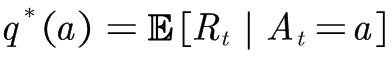
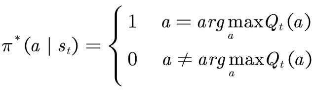
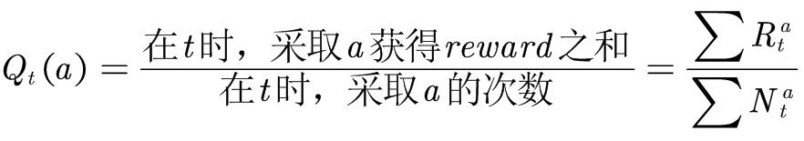
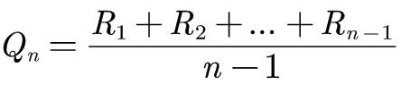
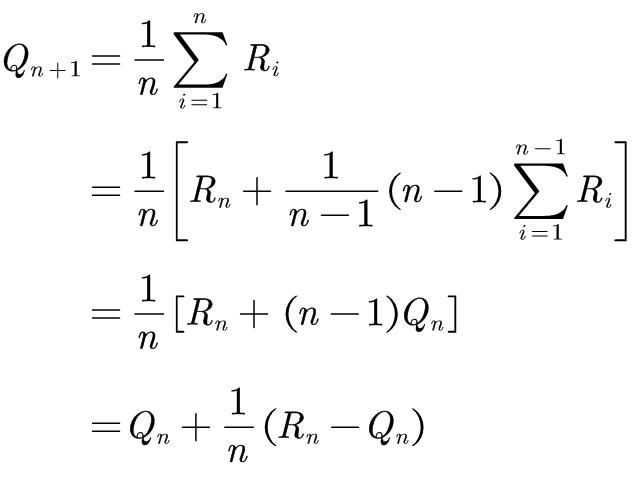
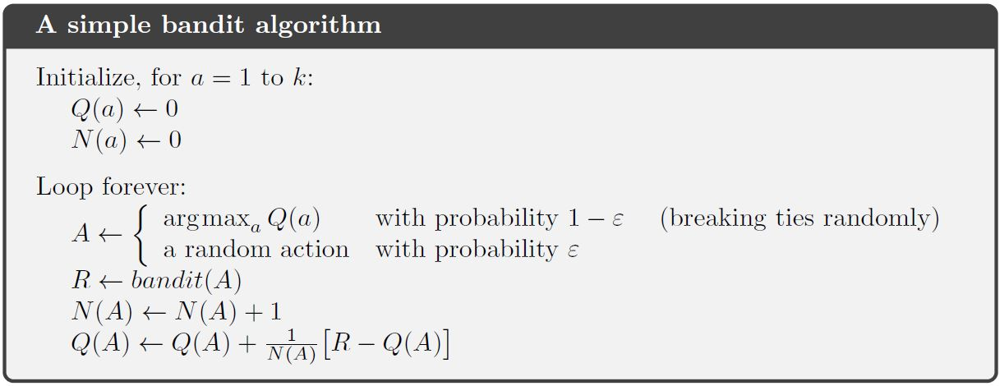

## K-armed bandits problem  

---  
### 学习目标  
- 搞清楚什么是K臂赌博机问题  
- WIP  

---  
### 知识要点  
- WIP  

---  
### 学习笔记  
#### #1 [Reinforcement Learning: An Introduction](http://incompleteideas.net/book/RLbook2018.pdf) - Chapter 2: Multi-armed Bandits  
#### 1.1 K臂赌博机问题  
K臂赌博机问题可以描述为：你可以重复不断地从K个不同动作action（犹如有K个摇杆的老虎机）中选择一个动作，之后，根据你选的动作，你会收到一个随机奖励值reward，这个reward服从一个稳定的概率分布。你的目标就是在一段时间内，使得收到的奖励值之和最大。  

很容易想到，只要我们不断重复选择最有可能获得最大reward的动作，就能在一段时间内获得最大累积奖励。下一个问题是，怎么知道哪个动作最有可能获得最大的reward呢？也容易想到，可用每个动作的reward的期望值，我们称其为该动作的value。数学表达式如下：  
  
但是，通常动作a的准确value q*(a)是不知道的。需要评估动作a的q*(a)，其评估值记为Q(a)，我们希望Q(a)无限接近q*(a)。引入Q(a)的同时，带来了一个强化学习始终要面临的问题，即到底是探索(exploration)好还是利用(exploitation)好。在知道准确q*(a)的情况下，我们只要重复选择value最大的动作，就能获得最大累积奖励。这种始终选择value最大的动作的策略，称之为贪婪策略(greedy policy)。当q*(a)不知道时，用其评估值Q(a)选动作，仍然采用贪婪策略可行吗？这种情况下，我们不能保证最大的Q(a)是真的最大，毕竟它只是评估值。exploitation就是利用已学到的知识，选择value最大的动作，短时间内获得奖励比较大，但是从长远看获得累积奖励不一定最大。exploration就是选择其它value较低的动作，再评估其Q(a)，说不定最好的动作就在其中。exploration虽然短时间内损失了reward，从长远看，它能发现真正最好的动作，而使累积奖励最大。  

exploitation与exploration是相互矛盾的。在不同的情况，它们带来的收益也不一样。在对Q(a)准确性把握不大时，最好exploration，反之，最好exploitation。在强化学习的问题中，探索与利用之间的trade-off是一门较深的学问。  

贪婪策略用数学表示为：  
  
其中π表示概率。就是，在t时，选择Q(a)最大的动作。为了平衡探索于利用的关系，引入ε-greedy策略，数学表达如下：  
  
即1-ε的概率选择最优动作，ε的概率随机选择一个动作。ε的值可以调节探索与利用之间的平衡。其优点是，随着时间的推移，每个动作都能被选取无限次，最终Q(a)收敛于q*(a)。  

#### 1.2 估计action-value的方法——均值法  
在时间t时，action-value的真实值是动作a获得reward的期望值。很容易想到，action-value的估计值Q(a)就用动作a获得reward的平均值。数学表达式如下：  
  
根据大数定律，当N趋于无穷大时，Q(a)收敛于q*(a)。  

#### 1.3 估计action-value的方法——增量式方法  
均值法有一个缺陷，只有在一系列动作决策之后，才能计算q*(a)的估计值Q(a)。如果动作序列很长，需要存储的a-reward数据对的量很大，计算Q(a)的计算量也很大，且Q(a)的更新速度也很慢。有没有一种新的Q(a)计算方法，每一步都在更新Q(a)？  

回归均值法的本质，对于某一个动作a，第i次被选取时的奖励值为R_i，Q_n表示a被选取n-1次后，q*(a)的估计值，数学表示如下：  
  
均值法每次计算Q(a)都要计算此式子，很低效。  

从这个式子，我们可以推导出一种增量式的计算方法：  
  
现在只要Q_n, R_n, n就能更新Q(a)，是一种增量式计算方法。  
伪代码如下，bandit()施加动作A，返回相应reward。  
  

#### 1.4 解决环境的不稳定问题  

---  
### 练习  