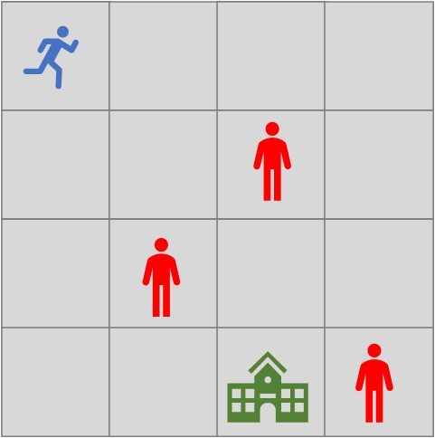

# Q_Learning  

> 参考源：[Diving deeper into Reinforcement Learning with Q-Learning](https://www.freecodecamp.org/news/diving-deeper-into-reinforcement-learning-with-q-learning-c18d0db58efe/)  

---  
#### 学习目标：  
- 从一个例子中引入Q_Table  
- Q_Table的更新  
- Q_Learning算法  
- Q_Learning的实现  
--- 

### 1.从以一个例子中引入Q_Table  
有这么一个例子：  
> - 一个4*4的地图  
> - 骑士救被困于城堡的公主  
> - 有三块地图上有敌人，且不能移动  
> - 骑士可以移动  

图示如下：  

**有什么方法能让骑士解救公主呢？**