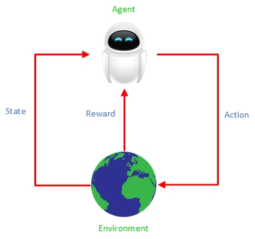
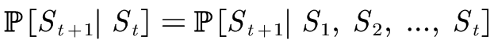
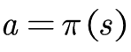
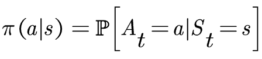
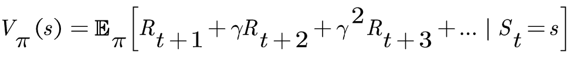
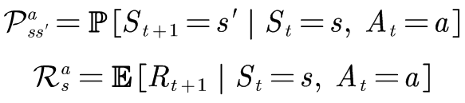

## 强化学习介绍  
---  

### 学习目标  
- 理解强化学习问题，以及与监督学习和非监督学习的区别  
- 利用OpenAI Gym中的强化学习环境  
--- 

### 知识要点  
- 强化学习(reinforecment learning, RL)是有关目标驱动(goal-directed)和做决策(decision-making)的学习算法  
- 在RL中，智能体(agent)从其与环境交互的经验中进行学习，而监督学习不与环境交互  
- agent的奖励(reward)通常是延迟的，agent的目标是最大化累计奖励值，因为最终的目标通常经次优的行为实现  
- agent与环境(environment)交互的数据包括 [state, reward, action]  
--- 

### 学习笔记  
#### **1** [Reinforcement Learning: An Introduction](http://incompleteideas.net/book/RLbook2018.pdf) - Chapter 1： Introduction  
机器学习方法可分为三种，即监督学习、无监督学习、强化学习。监督学习是训练一个模型来拟合给定的带标签的训练数据集，以预测训练集以外的情况；无监督学习是在给定的无标签的数据中训练一个模型将具有一定相似特征的数据聚类在一起；强化学习是从自己与环境交互的经验中学习，其目标是最大化累计奖励，方法是试错与行为评估。  

在强化学习中，agent必须能够感知环境的状态，施加的动作也必须能够改变环境的状态，环境中必须存在表示完成目标的状态。强化学习的三个重要特点：试错、奖励延迟、环境交互。强化学习的经验数据是从与环境交互中获得的。强化学习的挑战之一是权衡探索(exploration)与利用(exploitation)，agent为了获得奖励，既要利用尝试过的能够获得奖励的动作取得奖励，又要探索更多的动作空间，以发现能够获得奖励的行为。  

强化学习的学习模式是最接近人类和其他动作的学习模式。举个例子：初生的小绵羊能够在落地一两个小时之后活蹦乱跳。其中有几点值得注意：  
> - 小绵羊的目标是用四脚行走，但是初生时并不会  
> - 一两个小时之内，小绵羊不断尝试站起来行走，也不断摔倒  
> - 当小绵羊站起来后，其大脑会给一个积极的奖励信号  
> - 小绵羊能感知环境状态，其动作也能改变环境  

强化学习也有这些特点。  

强化学习的组成要素包括：agent、environment、reward signal、policy、value function。agent是编程者主体能控制的部分；environment是agent身处的环境，agent不能控制其但是与其交互；policy可以认为是在特定状态下采取哪个动作最佳，即状态到动作的映射关系；reward signal定义了强化学习问题，其定义了状态的好坏，但是reward是瞬时的，奖励值低说明agent本次表现不佳，可能需要改变policy了；value function表示了特定状态在完成目标的过程中的价值，即从给定状态起能够获得的累计奖励的预测，某个状态的奖励低不能说明其价值低，其状态可能是实现目标的必要步骤。  

强化学习利用markov决策过程框架来定义agent与environment之间的交互，即[state, actoin, reward, next_state]。  

强化学习发展的历史脉络：  
- 试错学习，灵感来于动物的学习方法。  
- 优化控制，方法是值函数和动态规划。  
- 时间差分方法，试错与优化控制的结合。  

#### **2** [David Silver's RL Course Lecture 1 - Introduction to Reinforcement Learning](http://www0.cs.ucl.ac.uk/staff/d.silver/web/Teaching_files/intro_RL.pdf)  
强化学习与其他机器学习模式的区别：  
- 没有监督，只有reward信号  
- reward信号有延迟  
- 事件间的时间关系很重要  
- agent的动作可以影响后续与环境交互的数据  

强化学习基于奖励假说（reward hypothesis），即agent的所有目标可以描述为最大化累计奖励。  
- reward是标量反馈信号  
- R_t表征agent在step t时表现的好坏  
- agent就是要最大化累积奖励  

顺序决策为持续对环境变化做出反应，在每个环境状态都选择一个action最大化累积奖励。  
- 动作的影响作用可能是持续的  
- reward可能是延迟的  
- 可能需要牺牲短期奖励，以获得更多长期奖励（如：玩象棋时，有时牺牲某些棋子对最终赢得游戏很有必要）  

agent与environment的关系：  
  
- 在每个step t处，agent要：（t随着系统的运行逐步增加）  
   - 接收环境状态 S_t  
   - 接收奖励值 r_t  
   - 施加动作 a_t  
- 在每个step t处，environment要：  
   - 接收动作 a_t  
   - 给出下一个环境状态 S_t+1  
   - 给出奖励值 r_t+1  

一个状态包含所有历史状态的信息，称之为Markov状态。当且仅当状态满足如下关系，该状态具有Markov性。  
  

一个强化学习agent可能包含一个或多个如下元素：  
- policy：agent的行为映射关系  
   - 状态到动作的映射关系  
   - 确定性policy：  
     
   - 随机policy：  
     
- value function：每个state、action、state-action的好坏  
   - 值函数是未来累积奖励的期望值  
   - 以评估每个state、action、state-action的好坏，基于此选择合适的动作  
   - 状态值函数有如下形式：  
     
- model：agent掌握的环境行为模型  
   - 以预测环境的下一步行为  
   - 包括预测下一步的state和reward  
   - 形式如下：  
     

强化学习按是否基于值函数/策略分类：  
- value based  
   - ~~policy~~  
   - value function  
- policy based  
   - policy  
   - ~~value function~~  
- actor critic  
   - policy  
   - value function  

强化学习按有无模型分类：  
- model free  
   - policy or/and value function  
   - ~~model~~  
- model based  
   - policy or/and value function  
   - model  

连续决策中的两类方法——learning、planing，其区别为：  
- reinforcement learning  
   - 初始时，环境模型未知  
   - agent与环境交互  
   - agent逐步改善策略  
- planing  
   - 环境模型已知  
   - 利用环境模型，agent可以计算出策略  
   - agent改善策略  

#### **3** [OpenAI Gym tutorial](https://gym.openai.com/docs)  
强化学习算法要真正跑起来，需要把agent放在一个环境中，但写一个较复杂的环境是不易的，于是诞生了Gym库。Gym是一个针对强化学习算法的环境库，其中包含各种环境，让researcher专注于研究强化学习算法，环境交给Gym，可直接调用。  

Gym中每个env包含的模块有：  
- reset  
   - 重置当前环境  
   - 返回重置后环境的state  
- step  
   - agent与环境交互  
   - 输入agent选择的action  
   - 返回施加action后的next_state, reward, done(是否该重置环境), info(一些调试信息)  
- render  
   - 渲染环境画面  

查询环境的动作空间和状态空间的方法：  
- action_space  
   - 方法：env.action_space  
   - env.action_space.n动作的个数  
   - Discrete(n)表示动作可取[0, 1, ..., n]的离散数字  
   - 动作空间也可能是连续的  
- state_space  
   - 方法：env.observation_space  
   - env.observation_space.shape状态空间维度信息  
   - Box(n, )表示状态空间是n维的，即state=[m1, m2, ..., mn]  
   - env.observation_space.high可以得到动作空间的上界  
   - env.observation_space.low可以得到动作空间的下界  

--- 
### 练习  
- [调用OpenAI Gym环境](code/OpenAI_Gym_EnvTest.py)  
