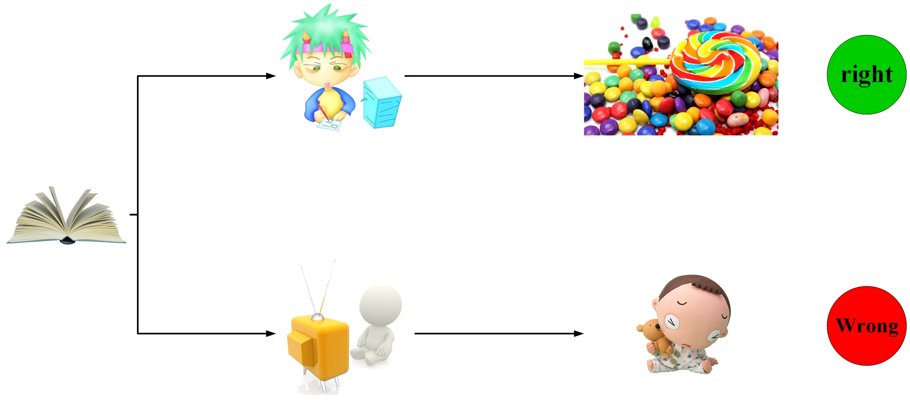
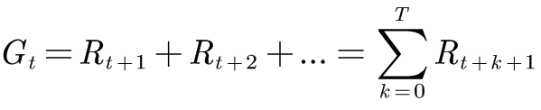
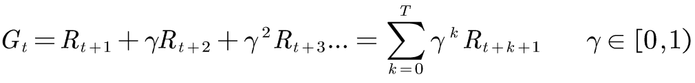
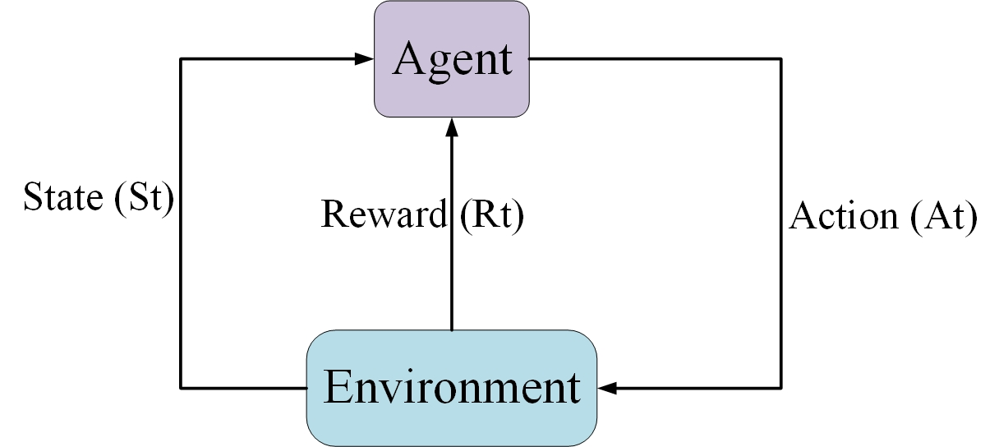
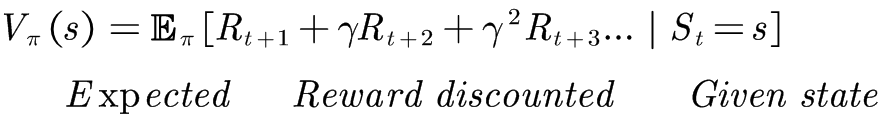
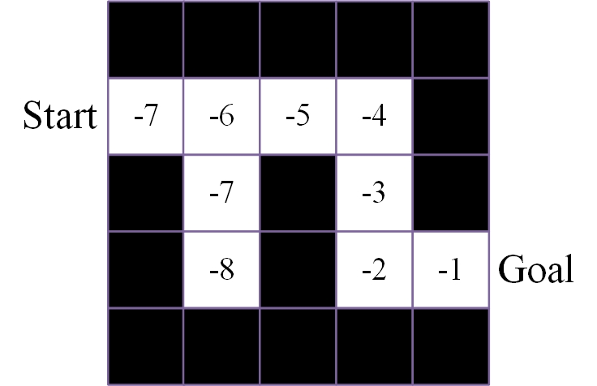
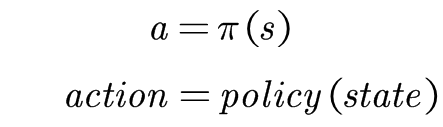
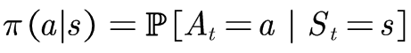
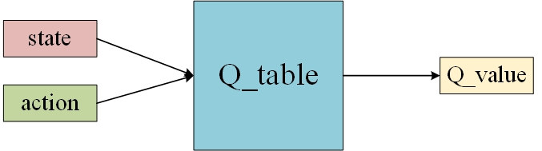
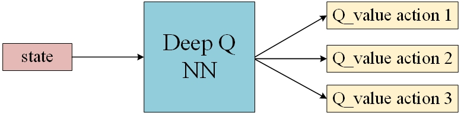

# An indroduction to Reinforcment Learning   
> 主要参考了[An indroduction to RL](https://www.freecodecamp.org/news/an-introduction-to-reinforcement-learning-4339519de419/)  

---  
#### 学习目标：  
- 什么是强化学习？ 强化学习的核心理念是什么？
- 强化学习的基本结构是什么？
- 强化学习的三种方法是什么？
- 深度强化学习与强化学习的区别？  
---  

## 1. 什么是强化学习？强化学习的核心理念是什么？  
讲强化学习之前先讲一个人类学习的例子。  
  
在图中，在作业的状态下。如果小孩做作业，就会得到糖果奖励，如果小孩去看电视，就会得到相应的惩罚。如果小孩两种情况都试过了，那么他就知道，在有作业的情况下他最好是先写作业，这样才能得到好的结果。这是一个简单的人类学习过程，是一个不断强化好的行为的过程，强化学习就是模拟的这个过程。  

强化学习即强化好的行为（或者叫策略），弱化不好的行为，最终在环境中学习到一个能完成目标的行为策略。  

强化学习的核心理念是**奖励假设**，即强化学习问题可以描述为最大化agent的累计奖励。因此，最终强化学习的目标转化为了最大化累计奖励。  

累计奖励可以描述为:  
  
实际上，累计奖励并不能这样计算，通常近期的奖励比远期的奖励更可靠，因此对远期的奖励应该有一个衰减，则带衰减因子的累计奖励可以表示为：  
  
γ越大则意味着agent更关注远期奖励。  

## 2. 强化学习的基本结构是什么？  
强化学习的结构图可以如下表示：  
  
强化学习算法的学习过程：  
- 智能体agent从环境中观察到初始状态S_0  
- 智能体agent根据初始状态S_0和相应的行为策略选择一个最佳动作A_0施加给环境  
- 环境对动作A_0做出反应，即从状态S_0转换到状态S_1  
- 环境给予智能体agent奖励值R_1  
- 回到第一步，循环往复  

这个强化学习循环过程，最终会得到一系列包含[state, action, reward, next_state]的数组。强化学习的目标就是最大化累计奖励，而解决强化学习问题。  

## 3. 强化学习的三种方法是什么？  
通常，强化学习方法分为三种：  
- Value-based RL  
- policy-based RL  
- model-based RL  

### 3.1 value-based RL  
在基于值函数的方法中，强化学习的目标是最大化值函数V(s)。  

值函数表示在某个状态s下，未来累计奖励的期望值（*之所以使用期望，是因为我们不知道累计奖励的真实值是多少，而使用期望去逼近它*），表示如下：  
  
利用这个值函数，智能体agent在当前状态下就知道选择到达哪个状态，才能得到更大的值函数。  
  
在迷宫的游戏中，只需在每一步都走值函数更大的格子，然后就能走出迷宫，如[-7, -6, -5, -4, -3, -2, -1]。

### 3.2 policy-based RL  
在基于策略的方法中，我们想直接优化策略函数π(s)，而不利用值函数V(s)。  

策略被定义为状态到动作的映射关系，如下：  
  
通常，有2中策略：
- 确定性策略： 在给定的状态下，总是确定性地输出同一个动作
- 随机性策略： 在给定的状态下，输出可选动作的概率分布。如下：  
    

可以看出，策略函数直接告诉智能体agent，在当前状态下，哪个动作是最佳动作。

### 3.3 model-based RL  
在基于模型的方法中，需要对环境进行建模，这是一个比较困难的任务。因此，基于模型的强化学习算法并不多。

## 4. 深度强化学习与强化学习的区别？  
在传统的强化学习中，agent是利用Q表来存储学到的知识，agent通过Q表来查询在当前状态下各可选动作的价值，从而选择价值更大的动作施加给环境，如下：  
  
但是，当强化学习问题中的state和action数量很大时，Q表就会很庞大，处理起来很困难。于是，引入神经网络来存储agent在环境中学到的知识，利用神经网络逼近Q值函数，其形式如下：  
  

